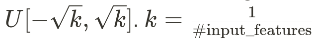
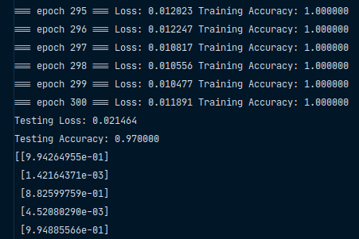

# Fully-Connected Model from Scratch

## Goal
Classify input data by doing backpropagation and renewing model parameters. Models are built from scratch, **without** using deep learning framework such as Tensorflow and PyTorch.

## Testing Cases
There are 2 cases. Each case contains 2 classes
### 1. Linear
 
### 2. XOR

## Model
### Neural Network
2 hidden layers & 1 output layer.  

### Weight Initialization
Drawn from  

### Activation Function
Sigmoid  
  
Derivative of sigmoid

### Loss Function
MSE Loss  

### Backpropagation

## Testing Results
### Linear Case
Settings:
- First/Sec hidden layer neurons: 3 & 3
- Learning rate = 1
- Batch size: 1/10 dataset size

Results:
- Testing loss: 0.021464
- Testing accuracy: 97%

Weights before training:  

Weights after training:  

### XOR Case

Weights before training:  

Weights after training:  

## Other Experiments

In this section, linear dataset are used for the following experiments. Basic setttings:

### Different Learning Rates

Settings:

- First & Second hidden layer neurons: 3 & 3
- Second hidden layer neurons: 3
- Batch size ratio: 1 （full-batch)

Model learns faster with higher learning rate. However, it's prone to be unstable with high learning rates. The blue curve drops in early stage but it swung for a period of time.

### Different Batch Size

Settings:

- First & Second hidden layer neurons: 3 & 3
- Learning rate: 0.1

P.S. "batch size ratio" times total number of data is batch size.

Training with a lower batch size performs better after the same epochs since model with a lower batch size updates more in a single epoch. In the graph, models with lower batch size ratio drop earlier but swing a lot. 

### Number of Neurons in Hidden Layers

Settings:

- First & Second hidden layer neurons: 3 & 3
- Second hidden layer neurons: 3
- Batch size ratio: 1 （full-batch)

Loss of 5x3 model drops fastest and loss of 2x3 drops slowest. However, 3x3 drops faster than 4x3. So, it's difficult to distinguish whether neuron number is the key factor.

From the next two graphs, we may consider more complicated models fit this linear dataset more.

